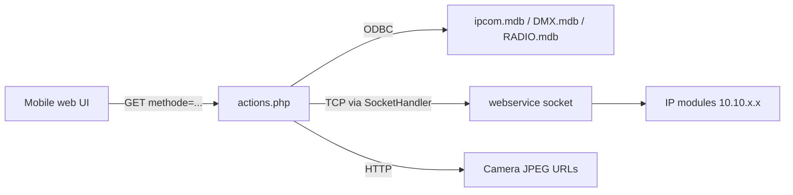

# IPBuilding Mobile API (`actions.php`)

Archived source: [`docs/reference/actions.php`](reference/actions.php)  
Controller path (legacy): `/mobile/core/actions.php`

This document describes the **legacy mobile web backend** used by the IPBuilding control web app. It is separate from the **REST v1 API** (`http://<host>:30200/api/v1/...`) that the Home Assistant integration uses today.

## Architecture overview



Every request is a **GET** with query parameter `methode` selecting the handler. Responses are plain text or HTML fragments (not JSON).

### Infrastructure (from source)

| Setting | Value |
|--------|--------|
| Timezone | `Europe/Brussels` |
| Socket backend | `$socketType = "webservice"` via `SocketHandler` |
| Main DB | `C:\Program Files\ipcom\ipcom.mdb` (Access via ODBC) |
| DMX DB | `C:\Program Files\ipcom\DMX.mdb` |
| Radio DB | `C:\Program Files\ipcom\RADIO.mdb` |
| i18n | `../assets/strings_{lang}.xml` (cookie `language`, default `nl`) |

Socket pattern for control commands:

1. `makeConnection("webservice", "tcp", "short"|"long")`
2. `writeToSocket(<command>)`
3. `getContentFromSocket()` → echo response
4. `writeToSocket("END")`
5. `closeSocket()`

## Protocol commands (socket layer)

These are the **actual** control strings sent to the IPBuilding webservice. The PHP layer only wraps them.

| `methode` | Socket command | Meaning |
|-----------|----------------|---------|
| `protocolToggleItem` | `TGL;{ip}-{ch}` | Toggle relay/output on module `{ip}`, channel `{ch}` |
| `protocolClearItem` | `CLR;{ip}-{ch}` | Clear / turn off |
| `protocolSetDimValue` | `DIM;{ip}-{ch}_{value}` | Set dimmer (`value` zero-padded to 2 digits if &lt; 10) |
| `protocolCallSoftComp` | `{reqStr}` (passthrough) | Arbitrary soft-component command |
| `protocolGetCurrRegime` | `AAVX` | Read current regime (first 4 chars of response) |
| `switchRegime` | `{regimeId}` (passthrough) | Activate regime |
| `getStatus` | `{reqStr}` | Status poll (long connection) |
| `activateTempDeviation` | `TAF;{ip}-{address}_{reqTemp}_{reqTime}` | Temporary temperature setpoint |
| `deleteTempDeviation` | `TAN;{ip}-{address}` | Cancel temp deviation |
| `getAudioPlayerStatus` | `INF;{ipBarix}` or `INF;{ipBarix};{ip}-{ch}` | Audio zone status |
| `audioPlayerPower` | `{reqStr}` | Audio power (client-built) |
| `audioPlayerSetValue` | `SET;{ip}-20_{vol}` / `-23_` / `-22_` | Vol / bass / treble |
| `audioPlayerNavigateValue` | `SET;{ip}-03_000` etc. | Up/down navigation |
| `protocolAudioPlayerLoadPlaylist` | `SET;{ip}-21_{playList}` | Load playlist |
| `protocolAudioPlayerLoadSong` | `SET;{ip}-33_{song}` | Load track |

### Example: your toggle URL

```
GET /mobile/core/actions.php?methode=protocolToggleItem&ip=10.10.1.32&ch=00
```

Internally becomes socket message:

```
TGL;10.10.1.32-00
```

- `ip` = IP address of the **field module** (not the controller).
- `ch` = channel/output id on that module (often matches `Output` in REST `comp/items`, but addressing is **IP + channel**, not numeric device `ID`).

## Handler reference by category

### Authentication (`ipcom.mdb` → table `paswoord`)

| `methode` | Params | Response |
|-----------|--------|----------|
| `loginCheck` | `username`, `password` (optional) | Username on success; else `local` / `remote` / `noLogin` / `noAccess` depending on server IP range |
| `changePassword` | `username`, `password`, `newPassword` | Username if old password OK |
| `setLoginAccount` | `username`, `password` | `ok` (insert only if no users exist) |

Local access is allowed without credentials when `SERVER_NAME` is `192.168.*`, `10.10.*`, or `127.0.0.1` and no password row exists (`noLogin`).

**Security note:** SQL is built via string concatenation (SQL injection risk). Passwords stored in plain text in Access DB.

### UI / HTML from database

| `methode` | Data source | Output |
|-----------|-------------|--------|
| `getGroupList` | `Componenten`, `SoftComp` | HTML `<ul>` left menu (groups + regimes `AAV%`) |
| `showGroupItems` | `Componenten` by `groupId` (Type) | HTML item list |
| `showGroupItemsSoft` | `SoftComp` by Type | HTML item list |
| `showGroupItemsDim` | `Componenten` where `Modula = 1` | All dimmers |
| `searchItems` | `Componenten` + `SoftComp` by description | HTML search results |

Filters: `mobileView = 1`, `actief = 1` for hardware components.

### DMX / LED (`DMX.mdb`)

| `methode` | Behavior |
|-----------|----------|
| `getLedStatus` | `reqStr` = semicolon-separated DMX channel ids → hex RGB per channel |
| `setLedColor` | `dmxCh`, `dmxColor` (RRGGBB hex) → UPDATE `Status` table |

### Video proxies

| `methode` | Fetches JPEG from module IP, caches under `assets/video/` |
|-----------|--------------------------------------------------------------|
| `showVideoImage` | By `modula` type: `/enu/camera…`, `/video.jpg`, or `/cgi-bin/viewer/video.jpg` |
| `refreshVideoImage` | Same sources, returns cached path |

### Audio player UI

| `methode` | Behavior |
|-----------|----------|
| `loadAudioPlayer` | Builds full player HTML; reads `playlist.txt`; resolves Barix IP via `Audioswitch` if `modula=3` |
| `audioPlayerLoadPlayList` | Song list from `c:\zserver\mp3\` or radio DB |
| Others | See protocol table above |

## Relation to REST v1 (Home Assistant integration)

| Aspect | Mobile `actions.php` | REST `/api/v1` |
|--------|----------------------|----------------|
| Transport | HTTP GET → PHP → TCP socket | HTTP GET JSON |
| Device identity | `ip` + `ch` (channel) | Numeric `ID` in `comp/items` |
| Toggle | `TGL;ip-ch` | `action/action?id=&actionType=TOGGLE` |
| Dim | `DIM;ip-ch_value` | `actionType=DIM&value=` |
| Discovery | Access DB + HTML | `GET /comp/items` |

On newer controllers (e.g. `192.168.0.185`), `/mobile/core/actions.php` may **not** be served (ASP.NET replaces `/mobile` routing). REST on port **30200** remains the supported path for HA.

Mapping tip: REST devices expose `IpAddress` and `Output`; mobile `ch` likely corresponds to zero-padded `Output` (e.g. output `0` → `ch=00`). Confirm on your installation.

## Files this script depends on (not archived)

- `classes/componentenModel.php`
- `classes/softCompModel.php`
- `classes/socketHandler.php` — implements TCP to `webservice`

Without `SocketHandler`, protocol methods cannot run.
